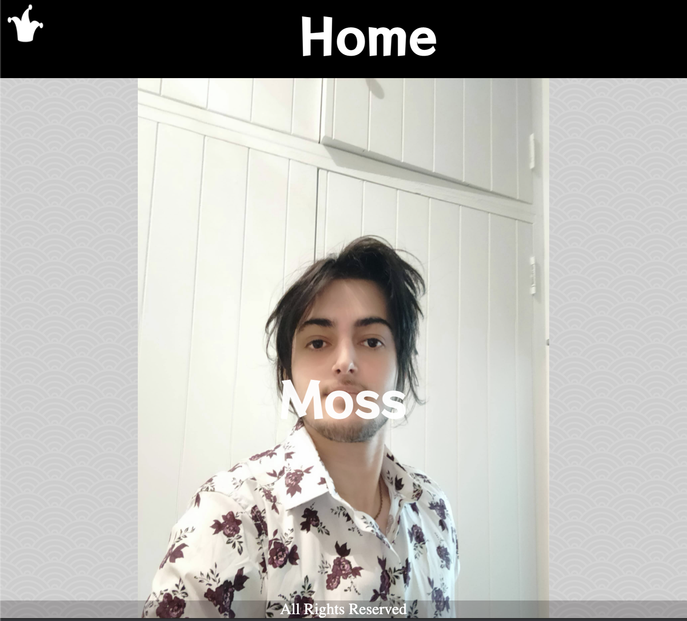

# Portfolio Site
## Link to Portfolio Site: 
https://wizardly-blackwell-b414f0.netlify.app

## GIT Repository:
https://github.com/Tmoss41/PortfolioSite

## Description: 
The purpose of this site is to advertise myself as an upcoming devloper, and to specifically outline my personality, skills and work and study history. Since this is advertising myself and my skills as a devloper, the target audience will be companies or businesses looking to hire a developer. The map will follow the structural format outlined below:

The site will have the following features on each page:
### Tech Stack:
Visual Studio Code
HTML5
Javascript
CSS3
SASS
Deployment Method: Netlify
Repository Service: Github

#### Home:
A Hamburger menu that will hide the Navigation bar for the website
A Hero Image in the centre of the Page
Text that will appear and reappear in the centre of the image
#### About:
A Hamburger menu that will hide the Navigation bar for the website
An Article Item with images that will repsonsively change its size and layout depending on the resolution of the page
#### Blog:
A Hamburger menu that will hide the Navigation bar for the website
An Article Item with images that will repsonsively change its size and layout depending on the resolution of the page
#### Blog Post Pages:
A Hamburger menu that will hide the Navigation bar for the website
An image and Text that will move and grow to match the resolution of the page

### Images of the Website:
I have also placed some screenshots of the site below:
#### Desktop Screenshots:

#### Tablet Screenshots:

#### Mobile Screenshots:

